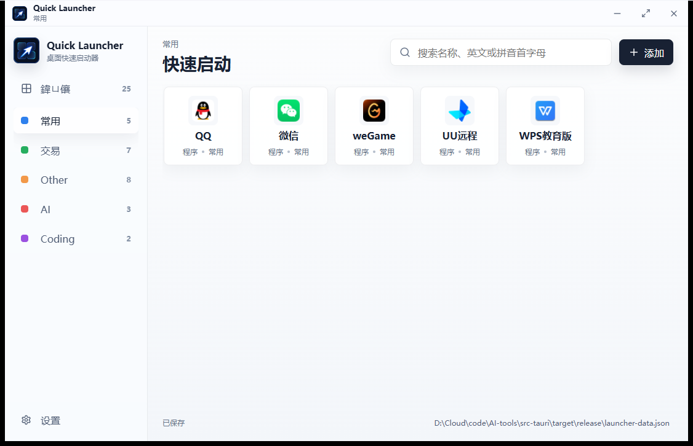

# Quick Launcher

Quick Launcher 是一个面向 Windows 桌面的快速启动器，用来集中管理常用程序、快捷方式和文件夹。它提供分类、搜索、图标提取、托盘常驻和全局热键，适合替代桌面上堆满的快捷方式。



## 功能介绍

- 添加和管理程序、快捷方式、文件夹启动项
- 分类侧栏与应用网格视图，支持拖拽排序
- 支持名称搜索、英文缩写搜索和中文拼音首字母搜索
- 自动提取程序或快捷方式图标，也支持手动选择图片、exe、lnk 作为图标来源
- 支持单击或双击启动模式
- 全局热键唤起窗口，默认 `Ctrl+Space`
- 托盘常驻，关闭窗口时可隐藏到托盘
- 启动项和设置保存到 exe 同目录的 `launcher-data.json`
- 支持开机自启动配置
- 记忆主窗口尺寸

## 技术栈

- Tauri v2：桌面应用容器、系统托盘、窗口管理和原生命令
- Rust：本地文件读写、快捷方式解析、图标提取、启动项执行、注册表自启动
- React 18：前端界面
- TypeScript：类型约束
- Vite：前端构建
- dnd-kit：拖拽排序
- lucide-react：界面图标
- Windows API：快捷方式解析、文件图标读取和开机启动注册

## 本地开发

安装依赖：

```powershell
npm.cmd install
```

启动 Tauri 开发模式：

```powershell
npm.cmd run tauri:dev
```

只调试前端：

```powershell
npm.cmd run dev
```

构建前端：

```powershell
npm.cmd run build
```

## 打包

Tauri 打包需要安装 Rust 工具链：

```powershell
winget install Rustlang.Rustup
```

重新打开终端后确认：

```powershell
rustc --version
cargo --version
```

生成 Windows 安装包：

```powershell
npm.cmd run tauri:build
```

构建产物位于：

```text
src-tauri/target/release/bundle/
```

## 项目结构

```text
src/                  React 前端代码
src-tauri/            Tauri 与 Rust 原生能力
src-tauri/icons/      应用图标资源
public/app-icon.png   前端使用的应用图标
```

## 数据说明

运行时数据默认保存在 exe 同目录：

```text
launcher-data.json
icons/
```

这两个路径已加入 `.gitignore`，不会提交到仓库。
